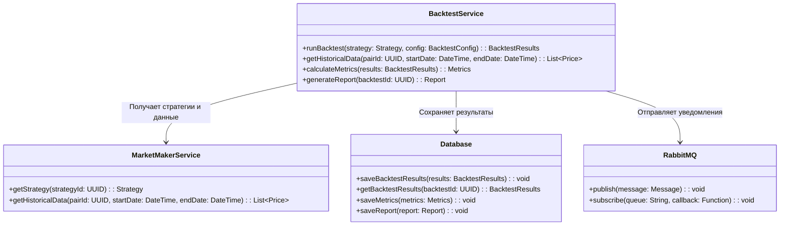
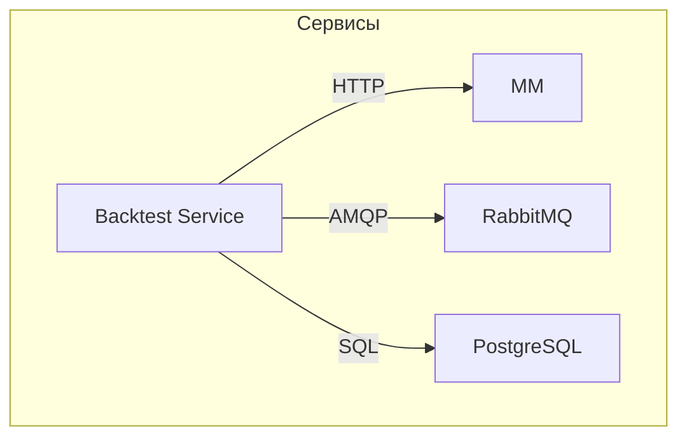

# Backtest Service

## Описание
Сервис бэктестинга предназначен для тестирования торговых стратегий на исторических данных, что позволяет оценить их эффективность перед использованием на реальном рынке.

## Основные функции
- Загрузка и обработка исторических данных
- Симуляция исполнения стратегий на исторических данных
- Расчет ключевых метрик эффективности
- Генерация отчетов о результатах тестирования

## Архитектура

### Схема взаимодействия компонентов


### Схема взаимодействия сервисов


## API Endpoints

### POST /api/v1/backtest/run
Запуск бэктестинга стратегии

```json
{
    "strategy_id": "uuid",
    "start_date": "2024-01-01T00:00:00Z",
    "end_date": "2024-01-20T00:00:00Z",
    "initial_balance": 100000,
    "pairs": ["BTC/USDT", "ETH/USDT"],
    "config": {
        "fee_rate": 0.001,
        "slippage": 0.0005
    }
}
```

### GET /api/v1/backtest/{backtestId}/results
Получение результатов бэктестинга

### GET /api/v1/backtest/{backtestId}/metrics
Получение метрик бэктестинга

### GET /api/v1/backtest/{backtestId}/report
Получение отчета о бэктестинге

## Метрики эффективности
- Общая прибыль/убыток
- Максимальная просадка
- Коэффициент Шарпа
- Количество сделок
- Процент успешных сделок
- ROI (Return on Investment)
- Волатильность

## Конфигурация
```yaml
backtest:
  max_parallel_tests: 5
  data_resolution: 1m
  default_fee_rate: 0.001
  default_slippage: 0.0005
  report_formats: [PDF, JSON]
```

## Интеграции
- Market Maker Service: для получения стратегий и исторических данных
- RabbitMQ: для асинхронного обмена сообщениями
- PostgreSQL: для хранения результатов и метрик

## Мониторинг
- Количество запущенных бэктестов
- Время выполнения бэктестов
- Использование памяти и CPU
- Количество обработанных исторических данных
