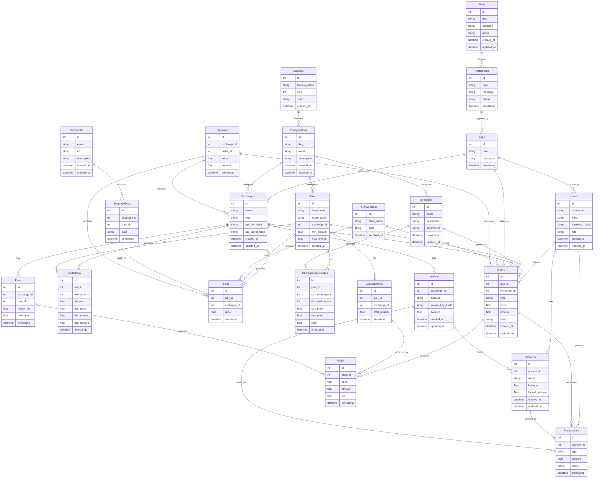

# Таблицы базы данных и их поля
=====================================

### Описание таблиц

| **Название таблицы**       | **Описание**                                                                 | **Поля**                                                                                   |
|----------------------------|-----------------------------------------------------------------------------|-------------------------------------------------------------------------------------------|
| **Users**                  | Хранение информации о пользователях системы.                                | `id`, `username`, `email`, `password_hash`, `role`, `created_at`, `updated_at`            |
| **Exchanges**              | Хранение информации о биржах (CEX и DEX).                                   | `id`, `name`, `type` (CEX/DEX), `api_key_hash`, `api_secret_hash`, `created_at`, `updated_at` |
| **Pairs**                  | Хранение информации о торговых парах.                                       | `id`, `base_asset`, `quote_asset`, `exchange_id`, `min_amount`, `max_amount`, `created_at`|
| **Orders**                 | Хранение информации о ордерах (покупка/продажа).                            | `id`, `pair_id`, `exchange_id`, `type` (buy/sell), `price`, `amount`, `status`, `created_at`, `updated_at` |
| **OrderBook**              | Хранение информации об ордербуке (стакане) для каждой пары на бирже.        | `id`, `pair_id`, `exchange_id`, `bid_price`, `ask_price`, `bid_amount`, `ask_amount`, `timestamp` |
| **Prices**                 | Хранение исторических данных о ценах.                                       | `id`, `pair_id`, `exchange_id`, `price`, `timestamp`                                       |
| **Balances**               | Хранение информации о балансах на аккаунтах.                                | `id`, `account_id`, `asset`, `balance`, `locked_balance`, `created_at`, `updated_at`      |
| **Transactions**           | Хранение информации о транзакциях (пополнения, выводы, переводы).           | `id`, `account_id`, `type` (deposit/withdraw/transfer), `amount`, `asset`, `timestamp`    |
| **Strategies**             | Хранение информации о стратегиях маркет-мейкера.                            | `id`, `name`, `description`, `parameters`, `created_at`, `updated_at`                     |
| **ArbitrageOpportunities** | Хранение информации о возможностях арбитража между биржами.                 | `id`, `pair_id`, `cex_exchange_id`, `dex_exchange_id`, `cex_price`, `dex_price`, `profit`, `timestamp` |
| **Logs**                   | Хранение логов системы (ошибки, события).                                   | `id`, `level` (info/warn/error), `message`, `timestamp`                                   |
| **Backups**                | Хранение информации о бэкапах базы данных.                                  | `id`, `backup_name`, `size`, `status`, `created_at`                                       |
| **ArchivedData**           | Хранение архивных данных (например, старых ордеров, цен).                   | `id`, `table_name`, `data`, `archived_at`                                                 |
| **Notifications**          | Хранение информации о уведомлениях (например, сбои, остановки сервисов).    | `id`, `type` (email/telegram), `message`, `status` (sent/failed), `timestamp`             |
| **Configurations**         | Хранение конфигураций системы (настройки бирж, пар, стратегий).             | `id`, `key`, `value`, `description`, `created_at`, `updated_at`                           |
| **Wallets**                | Хранение информации о кошельках (CEX и DEX).                                | `id`, `exchange_id`, `address`, `private_key_hash`, `balance`, `created_at`, `updated_at` |
| **Trades**                 | Хранение информации о сделках (исполненных ордерах).                        | `id`, `order_id`, `price`, `amount`, `fee`, `timestamp`                                   |
| **LiquidityPools**         | Хранение информации о пулах ликвидности на DEX.                             | `id`, `pair_id`, `exchange_id`, `total_liquidity`, `timestamp`                            |
| **Fees**                   | Хранение информации о комиссиях на биржах.                                  | `id`, `exchange_id`, `pair_id`, `maker_fee`, `taker_fee`, `timestamp`                     |
| **Subgraphs**              | Хранение информации о саб-графах для DEX.                                   | `id`, `name`, `url`, `description`, `created_at`, `updated_at`                            |
| **SubgraphData**           | Хранение данных, полученных из саб-графов.                                  | `id`, `subgraph_id`, `pair_id`, `data`, `timestamp`                                       |
| **Alerts**                 | Хранение информации о триггерах и уведомлениях.                             | `id`, `type` (price/volume/balance), `condition`, `action`, `created_at`, `updated_at`    |

## Схема связей между таблицами баз данных
=============================================

