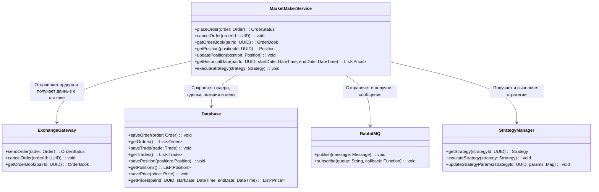

# Market Maker Service

## Описание
Market Maker Service является центральным компонентом системы, отвечающим за создание ликвидности на рынке путем размещения ордеров на покупку и продажу, а также за исполнение торговых стратегий.

## Основные функции
- Размещение и управление ордерами
- Мониторинг стакана заявок
- Исполнение торговых стратегий
- Управление позициями
- Работа с историческими данными

## Архитектура

### Схема взаимодействия компонентов


## API Endpoints

### POST /api/v1/orders
Размещение нового ордера

```json
{
    "pair_id": "uuid",
    "side": "BUY",
    "type": "LIMIT",
    "price": 50000.00,
    "amount": 1.0,
    "strategy_id": "uuid"
}
```

### DELETE /api/v1/orders/{orderId}
Отмена ордера

### GET /api/v1/orderbook/{pairId}
Получение стакана заявок

### GET /api/v1/positions/{positionId}
Получение информации о позиции

### POST /api/v1/strategies/execute
Запуск стратегии

```json
{
    "strategy_id": "uuid",
    "params": {
        "spread": 0.002,
        "order_size": 0.1,
        "max_position": 1.0
    }
}
```

## Компоненты системы

### ExchangeGateway
- Отправка ордеров на биржу
- Отмена ордеров
- Получение стакана заявок
- Обработка ответов от биржи

### Database
- Сохранение информации об ордерах
- Хранение сделок
- Управление позициями
- Хранение исторических данных

### RabbitMQ
- Асинхронный обмен сообщениями
- Уведомления о событиях
- Обработка очередей

### StrategyManager
- Управление торговыми стратегиями
- Исполнение стратегий
- Обновление параметров

## Конфигурация
```yaml
market_maker:
  default_spread: 0.002
  min_order_size: 0.001
  max_position_size: 10.0
  order_update_interval: 1s
  position_update_interval: 5s
```

## Интеграции
- Exchange Gateway: для работы с биржами
- Database: для хранения данных
- RabbitMQ: для обмена сообщениями
- Strategy Manager: для управления стратегиями

## Мониторинг
- Количество активных ордеров
- Объем торгов
- Прибыль/убыток позиций
- Задержка исполнения ордеров
- Использование памяти и CPU

## Описание схемы
MarketMakerService:

placeOrder: Размещает ордер на бирже через ExchangeGateway.

cancelOrder: Отменяет ордер на бирже через ExchangeGateway.

getOrderBook: Получает стакан заявок для конкретной торговой пары через ExchangeGateway.

getPosition: Возвращает информацию о текущей позиции.

updatePosition: Обновляет информацию о позиции.

getHistoricalData: Возвращает исторические данные о ценах.

executeStrategy: Выполняет торговую стратегию, полученную от StrategyManager.

ExchangeGateway:

sendOrder: Отправляет ордер на биржу.

cancelOrder: Отменяет ордер на бирже.

getOrderBook: Возвращает стакан заявок для конкретной торговой пары.

Database:

saveOrder: Сохраняет информацию о размещенных ордерах.

getOrders: Возвращает список ордеров.

saveTrade: Сохраняет информацию о совершенных сделках.

getTrades: Возвращает список сделок.

savePosition: Сохраняет информацию о позициях.

getPositions: Возвращает список позиций.

savePrice: Сохраняет исторические данные о ценах.

getPrices: Возвращает исторические данные о ценах для конкретной торговой пары.

RabbitMQ:

Используется для асинхронной отправки и получения сообщений, таких как уведомления о событиях (например, исполнение ордера).

StrategyManager:

getStrategy: Возвращает торговую стратегию по идентификатору.

executeStrategy: Выполняет торговую стратегию.

updateStrategyParams: Обновляет параметры торговой стратегии.

## Взаимодействие компонентов
Размещение и отмена ордеров:

MarketMakerService отправляет ордера на биржу через ExchangeGateway.

Информация о размещенных ордерах сохраняется в Database.

Получение данных о стакане заявок:

MarketMakerService запрашивает стакан заявок через ExchangeGateway.

Управление позициями:

MarketMakerService обновляет и сохраняет информацию о позициях в Database.

Получение исторических данных:

MarketMakerService запрашивает исторические данные о ценах из Database.

Выполнение стратегий:

MarketMakerService получает стратегии от StrategyManager и выполняет их.

Асинхронные уведомления:

MarketMakerService отправляет и получает сообщения через RabbitMQ (например, уведомления о исполнении ордеров).

## Пример последовательности действий

```mermaid
sequenceDiagram
    participant MarketMakerService
    participant ExchangeGateway
    participant Database
    participant RabbitMQ
    participant StrategyManager

    MarketMakerService->>ExchangeGateway: Отправка ордера (placeOrder)
    ExchangeGateway-->>MarketMakerService: Подтверждение размещения ордера
    MarketMakerService->>Database: Сохранение информации о ордере (saveOrder)
    MarketMakerService->>ExchangeGateway: Запрос стакана заявок (getOrderBook)
    ExchangeGateway-->>MarketMakerService: Возвращает стакан заявок
    MarketMakerService->>Database: Сохранение информации о сделке (saveTrade)
    MarketMakerService->>StrategyManager: Запрос стратегии (getStrategy)
    StrategyManager-->>MarketMakerService: Возвращает стратегию
    MarketMakerService->>MarketMakerService: Выполнение стратегии (executeStrategy)
    MarketMakerService->>RabbitMQ: Отправка уведомления о событии