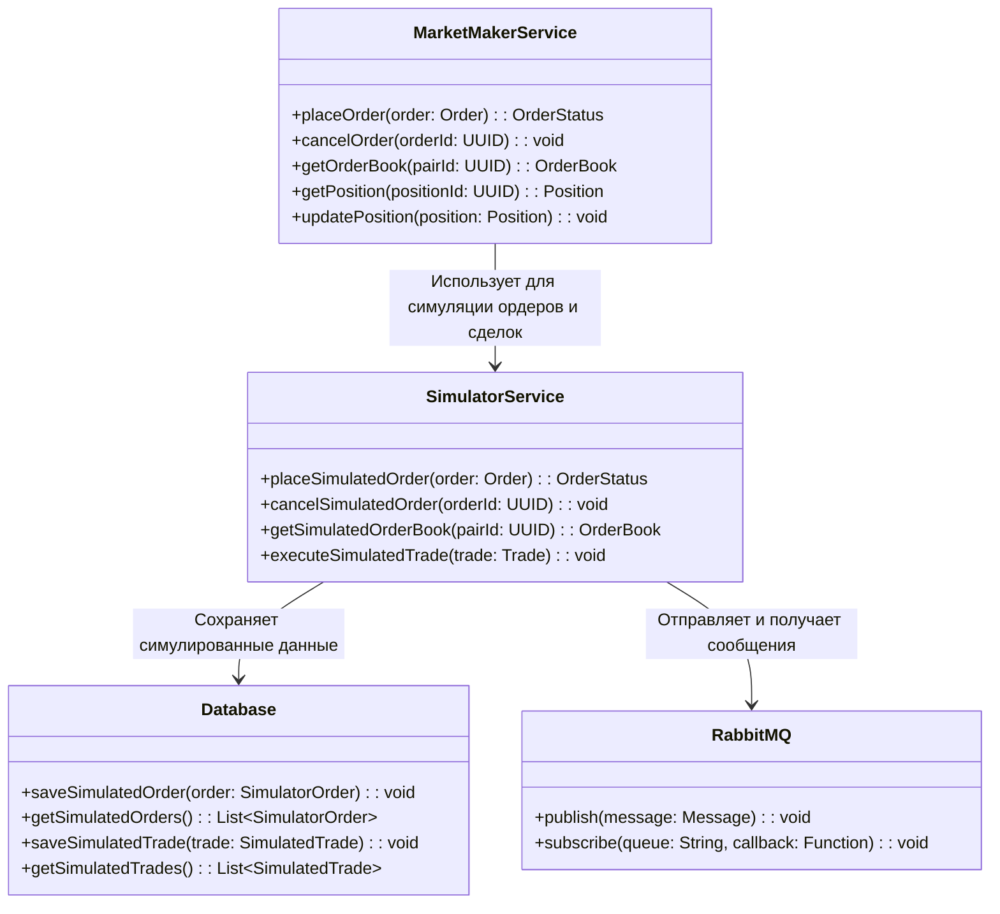
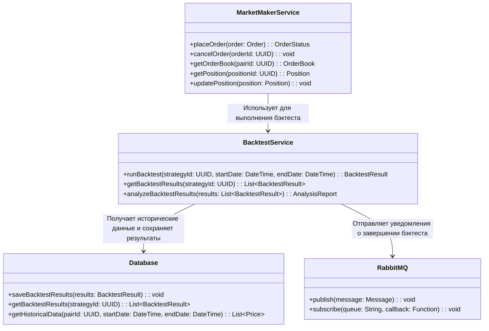
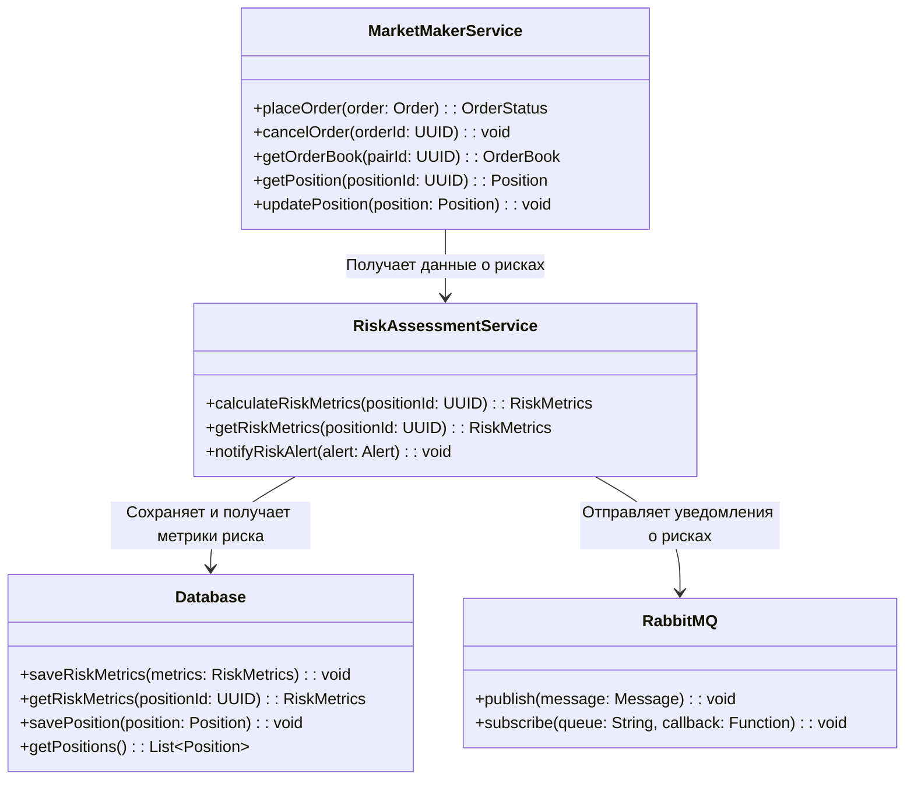
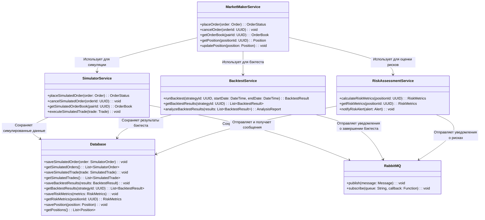

# Market Maker Service в режиме симуляции

## Описание
Market Maker Service в режиме симуляции взаимодействует с SimulatorService вместо реального ExchangeGateway.

SimulatorService имитирует размещение ордеров, отмену ордеров и выполнение сделок.

Данные о симулированных ордерах и сделках сохраняются в Database.

RabbitMQ используется для асинхронной обработки сообщений, таких как уведомления о симулированных событиях.

## Основные функции
- Симуляция размещения и управления ордерами
- Эмуляция стакана заявок
- Тестирование торговых стратегий
- Симуляция управления позициями
- Генерация синтетических данных

## Архитектура

### Схема взаимодействия компонентов


## API Endpoints

### POST /api/v1/simulator/orders
Размещение симулированного ордера

```json
{
    "pair_id": "uuid",
    "side": "BUY",
    "type": "LIMIT",
    "price": 50000.00,
    "amount": 1.0,
    "strategy_id": "uuid",
    "simulation_params": {
        "execution_probability": 0.8,
        "price_impact": 0.001
    }
}
```

### DELETE /api/v1/simulator/orders/{orderId}
Отмена симулированного ордера

### GET /api/v1/simulator/orderbook/{pairId}
Получение симулированного стакана заявок

## Компоненты системы

### SimulatorService
- Эмуляция биржевых операций
- Генерация рыночных данных
- Обработка ордеров
- Ведение симулированного стакана

### Database
- Хранение симулированных ордеров
- Запись симулированных сделок
- Управление виртуальными позициями
- Сохранение результатов тестов

### RabbitMQ
- Асинхронная обработка сообщений
- Отправка и получение сообщений

## Конфигурация
```yaml
simulator:
  default_balance: 100000 USDT
  price_deviation: 0.001
  execution_delay: 100ms
  market_update_interval: 1s
  test_modes: [NORMAL, STRESS, CUSTOM]
```

## Интеграции
- Market Maker Service: для тестирования стратегий
- RabbitMQ: для асинхронного обмена сообщениями
- PostgreSQL: для хранения результатов симуляции

## Мониторинг
- Количество симулированных ордеров
- Объем виртуальных торгов
- Время исполнения операций
- Использование памяти и CPU
- Качество симуляции рынка

# Market Maker Service в режиме бэктеста

## Описание
В режиме бэктеста MarketMakerService взаимодействует с BacktestService.

BacktestService использует исторические данные из Database для выполнения бэктеста.

Результаты бэктеста сохраняются в Database.

RabbitMQ используется для отправки уведомлений о завершении бэктеста.

## Основные функции
- Выполнение бэктеста на исторических данных
- Анализ результатов бэктеста
- Сохранение результатов бэктеста
- Отправка уведомлений о завершении бэктеста

## Архитектура

### Схема взаимодействия компонентов


## API Endpoints

### POST /api/v1/backtest
Выполнение бэктеста

```json
{
    "strategy_id": "uuid",
    "start_date": "2022-01-01",
    "end_date": "2022-01-31",
    "market_conditions": {
        "volatility": 0.02,
        "trend": "SIDEWAYS",
        "volume_profile": "NORMAL"
    }
}
```

### GET /api/v1/backtest/results/{strategyId}
Получение результатов бэктеста

## Компоненты системы

### BacktestService
- Выполнение бэктеста на исторических данных
- Анализ результатов бэктеста
- Сохранение результатов бэктеста
- Отправка уведомлений о завершении бэктеста

### Database
- Хранение результатов бэктеста
- Сохранение исторических данных
- Управление виртуальными позициями
- Сохранение результатов тестов

### RabbitMQ
- Отправка уведомлений о завершении бэктеста
- Асинхронная обработка сообщений

## Конфигурация
```yaml
backtest:
  default_balance: 100000 USDT
  price_deviation: 0.001
  execution_delay: 100ms
  market_update_interval: 1s
  test_modes: [NORMAL, STRESS, CUSTOM]
```

## Интеграции
- Market Maker Service: для выполнения бэктеста
- RabbitMQ: для отправки уведомлений о завершении бэктеста
- PostgreSQL: для хранения результатов бэктеста

## Мониторинг
- Количество выполненных бэктестов
- Объем виртуальных торгов
- Время исполнения операций
- Использование памяти и CPU
- Качество бэктеста

# Market Maker Service в режиме риск-менеджмента

## Описание
В режиме риск-менеджмента MarketMakerService взаимодействует с RiskAssessmentService.

RiskAssessmentService рассчитывает метрики риска (например, VaR, просадка) на основе данных о позициях.

Метрики риска сохраняются в Database.

RabbitMQ используется для отправки уведомлений о рисках.

## Основные функции
- Рассчет метрик риска
- Сохранение метрик риска
- Отправка уведомлений о рисках
- Управление рисками

## Архитектура

### Схема взаимодействия компонентов


## API Endpoints

### POST /api/v1/risk/assessment
Рассчет метрик риска

```json
{
    "position_id": "uuid",
    "risk_model": "VaR",
    "confidence_level": 0.95,
    "time_horizon": "1d"
}
```

### GET /api/v1/risk/metrics/{positionId}
Получение метрик риска

## Компоненты системы

### RiskAssessmentService
- Рассчет метрик риска
- Сохранение метрик риска
- Отправка уведомлений о рисках
- Управление рисками

### Database
- Хранение метрик риска
- Сохранение позиций
- Управление виртуальными позициями
- Сохранение результатов тестов

### RabbitMQ
- Отправка уведомлений о рисках
- Асинхронная обработка сообщений

## Конфигурация
```yaml
risk:
  default_confidence_level: 0.95
  default_time_horizon: 1d
  risk_models: [VaR, ExpectedShortfall]
```

## Интеграции
- Market Maker Service: для получения данных о рисках
- RabbitMQ: для отправки уведомлений о рисках
- PostgreSQL: для хранения метрик риска

## Мониторинг
- Количество рассчитанных метрик риска
- Объем виртуальных торгов
- Время исполнения операций
- Использование памяти и CPU
- Качество расчета метрик риска

# Общая схема взаимодействия Market Maker Service в разных режимах

## Описание
Market Maker Service взаимодействует с различными сервисами в зависимости от режима работы.

В режиме симуляции Market Maker Service взаимодействует с SimulatorService.

В режиме бэктеста Market Maker Service взаимодействует с BacktestService.

В режиме риск-менеджмента Market Maker Service взаимодействует с RiskAssessmentService.

## Архитектура

### Схема взаимодействия компонентов


## Режим симуляции
Market Maker Service взаимодействует с SimulatorService для имитации ордеров и сделок.

Данные сохраняются в Database, а уведомления отправляются через RabbitMQ.

## Режим бэктеста
Market Maker Service взаимодействует с BacktestService для выполнения бэктеста на исторических данных.

Результаты сохраняются в Database, а уведомления отправляются через RabbitMQ.

## Режим риск-менеджмента
Market Maker Service взаимодействует с RiskAssessmentService для оценки рисков позиций.

Метрики риска сохраняются в Database, а уведомления отправляются через RabbitMQ.