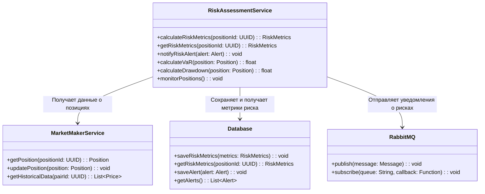

# Risk Assessment Service

## Описание
Сервис оценки рисков предназначен для анализа и мониторинга рисков торговых позиций, расчета ключевых метрик риска и генерации предупреждений при превышении установленных лимитов.

## Основные функции
- Расчет метрик риска (VaR, максимальная просадка)
- Мониторинг позиций в реальном времени
- Генерация алертов при превышении лимитов
- Анализ исторической волатильности

## Архитектура

### Схема взаимодействия компонентов


## API Endpoints

### POST /api/v1/risk/calculate
Расчет метрик риска для позиции

```json
{
    "position_id": "uuid",
    "metrics": ["var", "drawdown", "volatility"],
    "confidence_level": 0.95
}
```

### GET /api/v1/risk/metrics/{positionId}
Получение метрик риска для позиции

### GET /api/v1/risk/alerts
Получение активных алертов о рисках

### POST /api/v1/risk/limits
Установка лимитов риска

```json
{
    "position_id": "uuid",
    "limits": {
        "max_var": 5000,
        "max_drawdown": 0.1,
        "max_leverage": 5
    }
}
```

## Метрики риска
- Value at Risk (VaR)
- Максимальная просадка
- Волатильность
- Коэффициент Шарпа
- Бета-коэффициент
- Уровень левериджа

## Конфигурация
```yaml
risk:
  var_confidence_level: 0.95
  var_time_horizon: 1d
  alert_channels: [email, telegram]
  monitoring_interval: 5m
  historical_window: 30d
```

## Интеграции
- Market Maker Service: для получения данных о позициях
- RabbitMQ: для асинхронного обмена сообщениями
- PostgreSQL: для хранения метрик и алертов

## Мониторинг
- Количество активных алертов
- Время расчета метрик
- Количество мониторируемых позиций
- Использование памяти и CPU
- Задержка обновления метрик