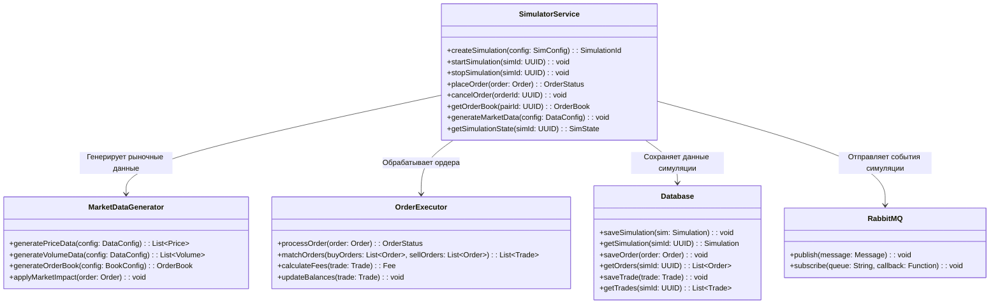

# Simulator Service

## Описание
Simulator Service предназначен для создания виртуальной торговой среды, которая имитирует поведение реальных бирж. Сервис позволяет тестировать торговые стратегии и алгоритмы без использования реальных средств.

## Основные функции
- Эмуляция биржевых операций
- Генерация синтетических рыночных данных
- Симуляция исполнения ордеров
- Имитация стакана заявок
- Расчет виртуального баланса

## Архитектура

### Схема взаимодействия компонентов


## API Endpoints

### POST /api/v1/simulations
Создание новой симуляции

```json
{
    "market_config": {
        "pairs": ["BTC/USDT", "ETH/USDT"],
        "initial_prices": {
            "BTC/USDT": 50000.00,
            "ETH/USDT": 3000.00
        },
        "volatility": 0.02,
        "trend": "SIDEWAYS"
    },
    "balance_config": {
        "BTC": 10.0,
        "ETH": 100.0,
        "USDT": 1000000.0
    },
    "execution_config": {
        "latency": 100,
        "slippage": 0.001,
        "fees": 0.001
    }
}
```

### POST /api/v1/simulations/{simId}/start
Запуск симуляции

### POST /api/v1/simulations/{simId}/stop
Остановка симуляции

### POST /api/v1/simulations/{simId}/orders
Размещение ордера в симуляции

```json
{
    "pair": "BTC/USDT",
    "side": "BUY",
    "type": "LIMIT",
    "price": 50000.00,
    "amount": 1.0
}
```

### GET /api/v1/simulations/{simId}/orderbook/{pair}
Получение стакана заявок для пары в симуляции

### GET /api/v1/simulations/{simId}/state
Получение текущего состояния симуляции

## Компоненты системы

### MarketDataGenerator
- Генерация ценовых данных
- Создание синтетического объема
- Формирование стакана заявок
- Расчет рыночного влияния

### OrderExecutor
- Обработка ордеров
- Сопоставление ордеров
- Расчет комиссий
- Обновление балансов

### Database
- Хранение состояния симуляций
- Сохранение ордеров
- Запись сделок
- Управление балансами

### RabbitMQ
- Публикация событий симуляции
- Обработка асинхронных операций

## Конфигурация
```yaml
simulator:
  market_data:
    update_interval: 1s
    price_precision: 2
    amount_precision: 8
  execution:
    default_latency: 100ms
    default_slippage: 0.001
    default_fees: 0.001
  persistence:
    cleanup_interval: 1h
    max_history_days: 30
```

## Интеграции
- Market Maker Service: для тестирования стратегий
- Risk Assessment Service: для оценки рисков
- PostgreSQL: для хранения данных симуляции
- RabbitMQ: для обмена сообщениями

## Мониторинг
- Количество активных симуляций
- Объем виртуальных торгов
- Задержка исполнения ордеров
- Использование памяти и CPU
- Качество генерации данных