Общая схема взаимодействия всех сервисов Simulator 

```mermaid
classDiagram
    class SimulatorService {
        +placeSimulatedOrder(order: Order): OrderStatus
        +cancelSimulatedOrder(orderId: UUID): void
        +getSimulatedOrderBook(pairId: UUID): OrderBook
        +executeSimulatedTrade(trade: Trade): void
    }

    class RiskAssessmentService {
        +calculateRiskMetrics(positionId: UUID): RiskMetrics
        +getRiskMetrics(positionId: UUID): RiskMetrics
        +notifyRiskAlert(alert: Alert): void
    }

    class BacktestService {
        +runBacktest(strategyId: UUID, startDate: DateTime, endDate: DateTime): BacktestResult
        +getBacktestResults(strategyId: UUID): List~BacktestResult~
        +analyzeBacktestResults(results: List~BacktestResult~): AnalysisReport
    }

    class MarketMakerService {
        +placeOrder(order: Order): OrderStatus
        +cancelOrder(orderId: UUID): void
        +getOrderBook(pairId: UUID): OrderBook
        +getPosition(positionId: UUID): Position
        +updatePosition(position: Position): void
        +getHistoricalData(pairId: UUID, startDate: DateTime, endDate: DateTime): List~Price~
        +executeStrategy(strategy: Strategy): void
    }

    class Database {
        +saveSimulatedOrder(order: SimulatorOrder): void
        +getSimulatedOrders(): List~SimulatorOrder~
        +saveSimulatedTrade(trade: SimulatedTrade): void
        +getSimulatedTrades(): List~SimulatedTrade~
        +saveRiskMetrics(metrics: RiskMetrics): void
        +getRiskMetrics(positionId: UUID): RiskMetrics
        +saveBacktestResults(results: BacktestResult): void
        +getBacktestResults(strategyId: UUID): List~BacktestResult~
    }

    class RabbitMQ {
        +publish(message: Message): void
        +subscribe(queue: String, callback: Function): void
    }

    SimulatorService --> MarketMakerService : Использует для взаимодействия с ордерами
    RiskAssessmentService --> MarketMakerService : Получает данные о позициях
    BacktestService --> MarketMakerService : Получает исторические данные
    SimulatorService --> Database : Сохраняет симулированные данные
    RiskAssessmentService --> Database : Сохраняет и получает метрики риска
    BacktestService --> Database : Сохраняет и получает результаты бэктестов
    SimulatorService --> RabbitMQ : Отправляет и получает сообщения
    RiskAssessmentService --> RabbitMQ : Отправляет уведомления о рисках
    BacktestService --> RabbitMQ : Отправляет уведомления о завершении бэктеста
```

Описание:
SimulatorService, RiskAssessmentService и BacktestService взаимодействуют с MarketMakerService для получения данных и выполнения операций.

Все сервисы используют Database для хранения данных и RabbitMQ для асинхронной обработки сообщений.