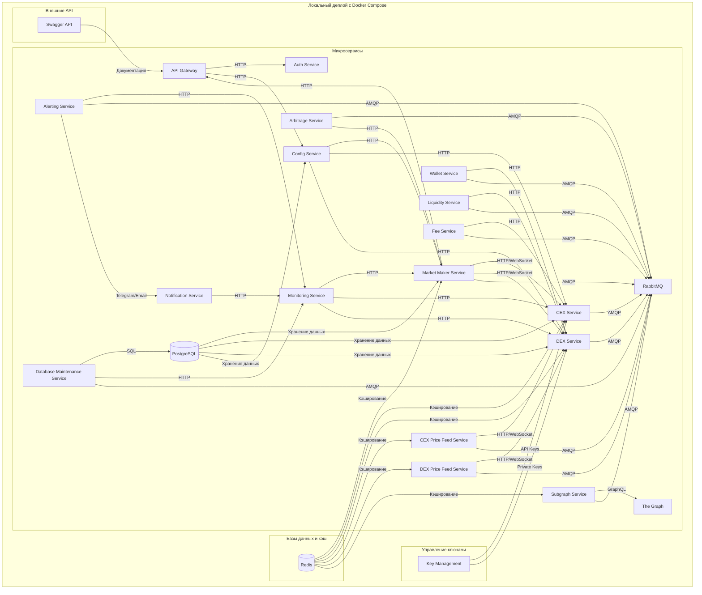

# Системная архитектура

## Локальный деплой с Docker Compose

### Диаграмма компонентов



### Описание компонентов

#### Основные сервисы
- **Market Maker Service**: Основной сервис для реализации маркет-мейкинга
- **CEX Service**: Сервис для работы с централизованными биржами
- **DEX Service**: Сервис для работы с децентрализованными биржами
- **API Gateway**: Единая точка входа для внешних запросов
- **Auth Service**: Сервис аутентификации и авторизации
- **Config Service**: Управление конфигурацией системы

#### Сервисы данных
- **CEX Price Feed**: Получение данных о ценах с CEX
- **DEX Price Feed**: Получение данных о ценах с DEX
- **Subgraph Service**: Интеграция с The Graph
- **Arbitrage Service**: Поиск арбитражных возможностей

#### Инфраструктурные сервисы
- **Monitoring Service**: Мониторинг состояния системы
- **Notification Service**: Отправка уведомлений
- **Alerting Service**: Система оповещений
- **DB Maintenance**: Обслуживание базы данных

#### Новые сервисы
- **Wallet Service**: Управление криптовалютными кошельками
- **Liquidity Service**: Управление ликвидностью на DEX
- **Fee Service**: Расчет и оптимизация комиссий

## AWS деплой

### Диаграмма компонентов AWS

```mermaid
flowchart TD
    subgraph AWS[Amazon Web Services]
        subgraph Микросервисы
            MM[Market Maker Service] -->|HTTP/WebSocket| CEX[CEX Service]
            MM -->|HTTP/WebSocket| DEX[DEX Service]
            MM -->|HTTP| API[API Gateway]
            API -->|HTTP| Auth[Auth Service]
            API -->|HTTP| Config[Config Service]
            MM -->|AMQP| RabbitMQ[RabbitMQ]
            CEX -->|AMQP| RabbitMQ
            DEX -->|AMQP| RabbitMQ
            Config -->|HTTP| MM
            Config -->|HTTP| CEX
            Config -->|HTTP| DEX
            Monitoring[Monitoring Service] -->|HTTP| MM
            Monitoring -->|HTTP| CEX
            Monitoring -->|HTTP| DEX
            Notification[Notification Service] -->|HTTP| Monitoring

            %% Новые сервисы для получения цен
            CEXPriceFeed[CEX Price Feed Service] -->|HTTP/WebSocket| CEX
            DEXPriceFeed[DEX Price Feed Service] -->|HTTP/WebSocket| DEX
            SubgraphService[Subgraph Service] -->|GraphQL| TheGraph[The Graph]
            SubgraphService -->|AMQP| RabbitMQ
            CEXPriceFeed -->|AMQP| RabbitMQ
            DEXPriceFeed -->|AMQP| RabbitMQ
            Arbitrage[Arbitrage Service] -->|AMQP| RabbitMQ
            Arbitrage -->|HTTP| MM

            %% Система нотификации
            Alerting[Alerting Service] -->|HTTP| Monitoring
            Alerting -->|AMQP| RabbitMQ
            Alerting -->|Telegram/Email| Notification

            %% Сервис для работы с базой данных
            DBMaintenance[Database Maintenance Service] -->|SQL| RDS[RDS (PostgreSQL)]
            DBMaintenance -->|HTTP| Monitoring
            DBMaintenance -->|AMQP| RabbitMQ

            %% Новые сервисы
            WalletService[Wallet Service] -->|HTTP| DEX
            WalletService -->|AMQP| RabbitMQ
            LiquidityService[Liquidity Service] -->|HTTP| DEX
            LiquidityService -->|AMQP| RabbitMQ
            FeeService[Fee Service] -->|HTTP| CEX
            FeeService -->|AMQP| RabbitMQ
        end

        subgraph Базы данных и кэш
            ElastiCache[ElastiCache (Redis)] -->|Кэширование| MM
            ElastiCache -->|Кэширование| CEX
            ElastiCache -->|Кэширование| DEX
            ElastiCache -->|Кэширование| CEXPriceFeed
            ElastiCache -->|Кэширование| DEXPriceFeed
            ElastiCache -->|Кэширование| SubgraphService
            RDS[RDS (PostgreSQL)] -->|Хранение данных| MM
            RDS -->|Хранение данных| CEX
            RDS -->|Хранение данных| DEX
            RDS -->|Хранение данных| Config
        end

        subgraph Управление ключами
            SecretsManager[Secrets Manager] -->|API Keys| CEX
            SecretsManager -->|Private Keys| DEX
        end

        subgraph Внешние API
            Swagger[Swagger API] -->|Документация| API
        end

        subgraph Оркестрация
            ECS[ECS (Elastic Container Service)] -->|Запуск контейнеров| Микросервисы
            ECS -->|Запуск контейнеров| RabbitMQ
        end

        subgraph Мониторинг и логи
            CloudWatch[CloudWatch] -->|Метрики и логи| Monitoring
            CloudWatch -->|Метрики и логи| Notification
            CloudWatch -->|Метрики и логи| Alerting
        end
    end
```

### AWS Сервисы

#### Вычислительные ресурсы
- **ECS (Elastic Container Service)**: Оркестрация контейнеров
- **EC2**: Виртуальные машины для размещения сервисов

#### Хранение данных
- **RDS**: Управляемая PostgreSQL база данных
- **ElastiCache**: Управляемый Redis для кэширования

#### Безопасность
- **Secrets Manager**: Управление секретами и ключами
- **IAM**: Управление доступом

#### Мониторинг
- **CloudWatch**: Мониторинг и логирование
- **CloudTrail**: Аудит действий в AWS